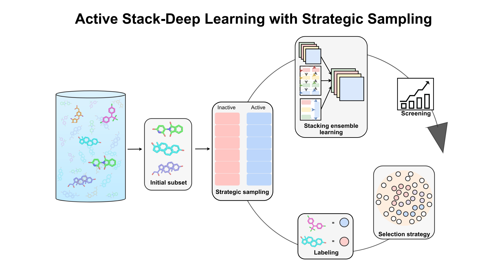

# **Active Stack-Deep Learning with Strategic Sampling for Small and Imbalance Chemical Toxicity Prediciton**

### Darlene Nabila Zetta†, Watshara Shoombuatong‡, and Tarapong Srisongkram*

†Graduate School in the Program of Pharmaceutical Sciences, Faculty of Pharmaceutical Sciences, Khon Kaen University, Thailand. (darlenenabilazetta.d@kkumail.com)

‡Center for Research Innovation and Biomedical Informatics, Faculty of Medical Technology, Mahidol University, Bangkok, 10700, Thailand. (watshara.sho@mahidol.ac.th)

*Division of Pharmaceutical Chemistry, Faculty of Pharmaceutical Sciences, Khon Kaen University, Thailand. (tarasri@kku.ac.th)

Full paper submitted in **ACS Omega**.

## 📋 Table of Contents

- [Overview](#overview)
- [Requirements](#requirements)
- [Setup Instructions](#setup-instructions)
- [Data Preparation](#data-preparation)
- [Training the Model](#training-the-model)
- [Evaluation](#evaluation)
- [Reproducing Results](#reproducing-results)
- [Citation](#citation)
- [MIT License](#mit-license)

### MIT License
Copyright (c) [2025] [Dr.Tarapong Srisongram]

Permission is hereby granted, free of charge, to any person obtaining a copy of this software and associated documentation files (the "Software"), to deal in the Software without restriction, including the rights to use, copy, modify, merge, publish, distribute, sublicense, and/or sell copies of the Software, and to permit persons to whom the Software is furnished to do so, subject to the following conditions:

The above copyright notice and this permission notice shall be included in all copies or substantial portions of the Software.

THE SOFTWARE IS PROVIDED "AS IS", WITHOUT WARRANTY OF ANY KIND, EXPRESS OR IMPLIED, INCLUDING BUT NOT LIMITED TO THE WARRANTIES OF MERCHANTABILITY, FITNESS FOR A PARTICULAR PURPOSE AND NONINFRINGEMENT. IN NO EVENT SHALL THE AUTHORS OR COPYRIGHT HOLDERS BE LIABLE FOR ANY CLAIM, DAMAGES OR OTHER LIABILITY, WHETHER IN AN ACTION OF CONTRACT, TORT OR OTHERWISE, ARISING FROM, OUT OF OR IN CONNECTION WITH THE SOFTWARE OR THE USE OR OTHER DEALINGS IN THE SOFTWARE.
